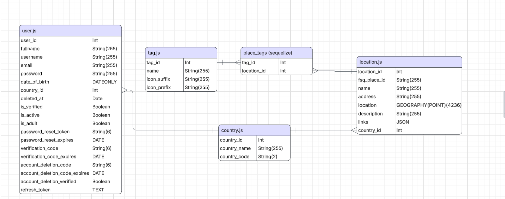
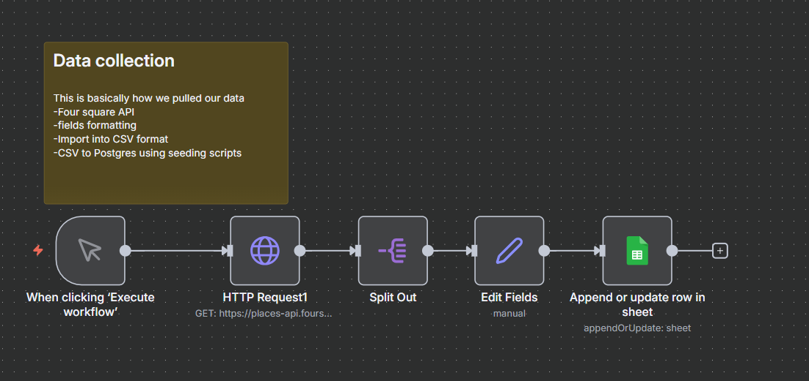

# NextPlore - Time Saving City Explorer

<p align="center">
  
</p>

NextPlore is an intelligent location recommendation engine designed to help tourists explore cities spontaneously. Unlike traditional travel apps that focus on rigid itineraries, NextPlore uses geospatial querying and tag-based filtering to suggest relevant venues (museums, cafes, clubs) within a user's immediate vicinity.

This project demonstrates a robust relational database implementation using **PostgreSQL**, **PostGIS**, and **Sequelize ORM**, featuring advanced geospatial indexing, data normalization, and a scalable architecture.

---

## 📚 Table of Contents

1. [Project Architecture](#-project-architecture)
2. [Database Design & ER Model](#-database-design--er-model)
3. [Data Pipeline](#-data-pipeline)
4. [Use Cases](#-use-cases)
5. [Setup & Installation](#-setup--installation)
6. [Performance & Optimization](#-performance--optimization)
7. [API Documentation](#-api-documentation)
8. [Development Credits](#-development-credits)
9. [License](#-license)

---

## 🏗 Project Architecture

The application is built as a decoupled system:

- **Frontend:** React (Vite), Leaflet (Interactive Maps), CSS for styling.
- **Backend:** Node.js, Express.js REST API.
- **Database:** PostgreSQL with **PostGIS** extension for geospatial data types.
- **ORM:** Sequelize (handling data models, validations, relationships, and indexing).

---

## 🗂 Database Design & ER Model

The database schema is normalized to **3NF** to minimize redundancy and ensure data integrity.

### Entity Relationships

- **Users:** Stores authentication (hashed passwords) and profile data. Linked to `Country` via a Foreign Key.
- **Locations:** Stores venue data. Crucially, it contains a geospatial `GEOGRAPHY(POINT)` column for accurate distance calculations on the earth's surface.
- **Tags:** Categorizes locations (e.g., "Vintage", "Quiet", "Live Music").
- **Countries:** A lookup table for standardized country codes and flags.

### Cardinality

1. **User ↔ Country:** **Many-to-One**
2. **Location ↔ Country:** **Many-to-One**
3. **Location ↔ Tag:** **Many-to-Many**
   - _Implementation:_ Managed via junction table `place_tag`.
   - _Reasoning:_ A location can have multiple tags; one tag can apply to many locations.

### Entity-Relationship Diagram



---

## 🔄 Data Pipeline

Data collection and seeding are handled through a specific pipeline to ensure data quality before it reaches the production database. We utilize the Foursquare API for raw data, process it into CSVs, and use Node.js seeding scripts to populate the PostgreSQL database.



---

## 🚀 Use Cases

This application implements the following core functionalities:

### 1. User Authentication & Profile

- **Registration & Login:** Secure JWT-based authentication (Access + Refresh tokens).
- **Email Verification:** Simulated email flow with verification codes.
- **Profile Management:** Update username, full name, and country.
- **Security:** Password reset flow and secure account deletion.

### 2. Geospatial Discovery (Core Feature)

- **"Near Me" Search:** Users can instantly see venues within a dynamic radius.
- **Smart Recommendations:** Filter results by tags (e.g., "Find _Cozy_ and _Quiet_ cafes").

### 3. Location Details

- View metadata.
- **Navigation:** Deep-linking to Google Maps.

---

## 🛠 Setup & Installation

Follow these steps to set up the development environment locally.

### Prerequisites

- **Node.js** (v16+)
- **PostgreSQL** (v13+)
- **PostGIS Extension** installed

---

### 1. Database Setup

1. Open your Postgres terminal or GUI.
2. Create the database:
   ```sql
   CREATE DATABASE nextplore_db;
   ```
3. Enable PostGIS:
   ```sql
   \c nextplore_db
   CREATE EXTENSION postgis;
   ```

---

### 2. Backend Configuration

1. Navigate to the backend folder:
   ```bash
   cd Backend
   npm install
   node index.js
   ```
2. Create a `.env` file (based on `.envsample`):

   ```env
   # PostgreSQL Configuration
    PORT=8000
    PG_HOST=localhost
    PG_USER=your_postgres_username
    PG_PASSWORD=your_postgres_password
    PG_DATABASE=nextplore_db
    PG_PORT=5432

    # JWT Configuration
    # IMPORTANT: Generate a strong, random secret key for production
    JWT_ACCESS_SECRET=super_secret_key_123
    JWT_REFRESH_SECRET=super_secret_key_456
    JWT_ACCESS_EXPIRES_IN=8h
    JWT_REFRESH_EXPIRES_IN=7d

    # Email Configuration (Gmail)
    EMAIL_USER=your_email@gmail.com
    EMAIL_APP_PASSWORD=your_app_password
    FRONTEND_URL=http://localhost:5173
   ```

---

### 3. Data Import (Seeding)

Run the scripts **in this exact order**:

```bash
# 1. Import Countries
node addcountries.js

# 2. Import Locations
node addlocations.js

# 3. Update Metadata & Create Tags
node updateLocationsAndTags.js
```

---

### 4. Frontend Setup

1. Navigate to the frontend folder:
   ```bash
   cd Frontend
   npm install
   ```
2. Create a `.env` file with the following content:
   ```env
   VITE_API_BASE_URL=http://localhost:8000/api
   VITE_FRONTEND_URL=http://localhost:5173
   ```
3. Start the development server:
   ```bash
   npm run dev
   ```

---

## ⚡ Performance & Optimization

The application is optimized for fast geospatial queries. By using the **PostGIS** extension, we leverage **GiST (Generalized Search Tree)** indexes on the `GEOGRAPHY` column of the `locations` table. This allows for highly efficient radius searches and distance calculations, ensuring a responsive user experience when finding nearby locations.

---

## 📝 API Documentation

The backend provides a RESTful API with the following main endpoints:

- **`/api/users`**: User registration, login, profile management, and authentication.
- **`/api/locations`**: Fetching location data, including geospatial queries for nearby locations.
- **`/api/tags`**: Fetching tags for filtering locations.
- **`/api/countries`**: Fetching country data.
- **`/api/home`**: General purpose routes.

For detailed information on each endpoint, please refer to the route definitions in the `Backend/src/routes` directory.

---

## 👥 Development Credits

This project was developed collaboratively. Below is a breakdown of contributions:

### Krzysztof Durski

- User data model
- User controllers
- User routes
- Country data model
- Country controllers
- Country routes
- Authentication [JWT, emailServices] (with AI)
- Data collection: tagging
- Wire frames

### Aditya Sai Prem

- Location data model [postGIS]
- Location controllers
- Location routes
- Tag data model
- Tag controllers
- Tag routes
- Server logic
- Data collection: n8n chain
- Utility functions

### Together

- ER diagram
- Data collection
- Frontend
- Logic

---

## 📜 License

This project is licensed under the MIT License.

---

## 🤖 AI Usage Note

This project utilized AI assistance for various aspects of development:

- **Code Autocompletion:** AI was used for code autocompletion throughout the development process.
- **Frontend Development:** The entire frontend was developed with AI assistance.
- **Location Tagging:** A Hybrid of AI and Human was used for tagging.
- **Database Scripts:** AI was used to create scripts for populating the database.
- **Documentation:** This README file was created with AI assistance.
- **Authentication:** AI was used to generate code used for authentication and security related functions (temporary solution)

**Important:** All AI-generated content was reviewed, checked, and modified by human developers as necessary to ensure accuracy, quality, and alignment with project requirements.
